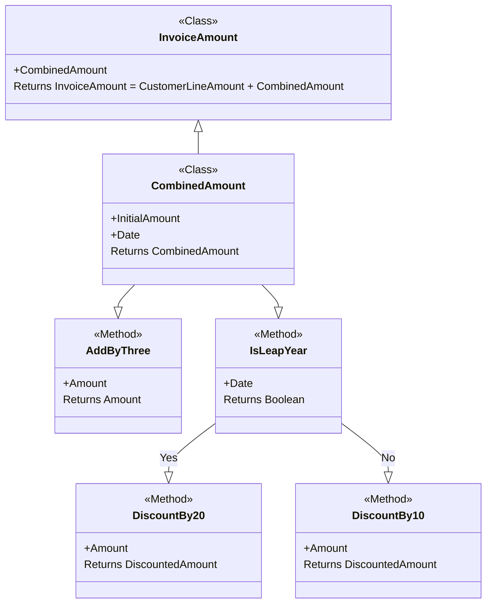

```mermaid
%%This is a single class, Treat the class as methods
classDiagram
CombinedAmount --|> AddByThree
CombinedAmount --|> IsLeapYear
IsLeapYear --|> DiscountBy20 :Yes
IsLeapYear --|> DiscountBy10 :No

%%Final amount is equal to Discount
InvoiceAmount <|-- CombinedAmount

class CombinedAmount {
  <<Class>>
  +InitialAmount
  +Date
  Returns CombinedAmount
}

class AddByThree {
  <<Method>>
  +Amount
  Returns Amount
}

class DiscountBy20 {
  <<Method>>
  +Amount
  Returns DiscountedAmount
}

class DiscountBy10 {
  <<Method>>
  +Amount
  Returns DiscountedAmount
}

class IsLeapYear {
  <<Method>>
  +Date
  Returns Boolean
}

class InvoiceAmount {
  <<Class>>
  +CombinedAmount
  Returns InvoiceAmount = CustomerLineAmount + CombinedAmount
}

```