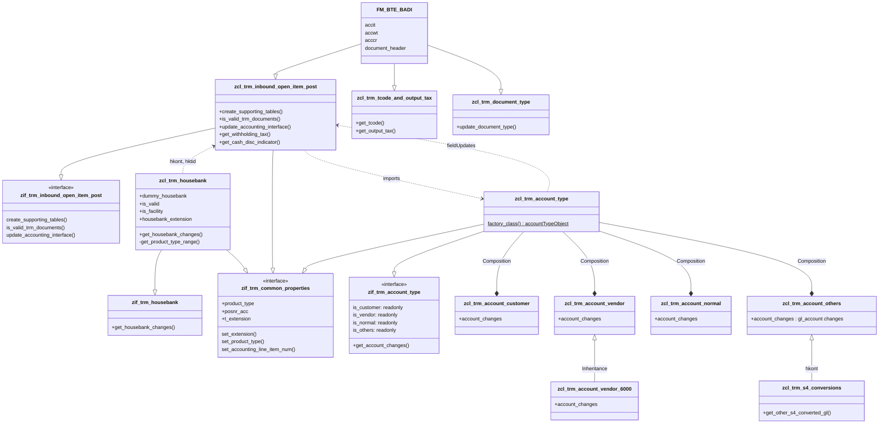

```mermaid

classDiagram
    FM_BTE_BADI --|> zcl_trm_inbound_open_item_post
    FM_BTE_BADI --|> zcl_trm_tcode_and_output_tax
    FM_BTE_BADI --|> zcl_trm_document_type
    zcl_trm_inbound_open_item_post --|> zif_trm_inbound_open_item_post
    zcl_trm_housebank --|> zif_trm_housebank
    zcl_trm_housebank --|> zif_trm_common_properties
    zcl_trm_inbound_open_item_post --|> zif_trm_common_properties
    zcl_trm_account_type --|> zif_trm_common_properties
    zcl_trm_account_type --|> zif_trm_account_type
    zcl_trm_inbound_open_item_post ..> zcl_trm_account_type : imports
    zcl_trm_inbound_open_item_post <.. zcl_trm_account_type : fieldUpdates
    zcl_trm_account_type --* zcl_trm_account_customer : Composition
    zcl_trm_account_type --* zcl_trm_account_vendor : Composition
    zcl_trm_account_type --* zcl_trm_account_normal : Composition
    zcl_trm_account_type --* zcl_trm_account_others : Composition
    zcl_trm_inbound_open_item_post <.. zcl_trm_housebank : hkont, hktid
    zcl_trm_account_vendor <|-- zcl_trm_account_vendor_6000 : Inheritance
    zcl_trm_account_others <|-- zcl_trm_s4_conversions : hkont
    %%method is_valid_trm_documents contains unit testing
    %%main method to test is update_accounting_interface
    class FM_BTE_BADI{
        accit
        accwt
        acccr
        document_header
    }
    class zif_trm_common_properties{
        <<interface>>
        +product_type
        +posnr_acc
        +t_extension
        set_extension()
        set_product_type()
        set_accounting_line_item_num()
    }
    class zif_trm_inbound_open_item_post{
        <<interface>>
        create_supporting_tables()
        is_valid_trm_documents()
        update_accounting_interface()
    }
    class zif_trm_housebank{
        +get_housebank_changes()
    }
    class zif_trm_account_type {
        <<interface>>
        is_customer: readonly
        is_vendor: readonly
        is_normal: readonly
        is_others: readonly
        +get_account_changes()
    }
    class zcl_trm_inbound_open_item_post{
        +create_supporting_tables()
        +is_valid_trm_documents()
        +update_accounting_interface()
        +get_withholding_tax()
        +get_cash_disc_indicator()
    }
    %%method get_housebank_changes contains unit testing
    class zcl_trm_housebank{
        +dummy_housebank
        +is_valid
        +is_facility
        +housebank_extension
        +get_housebank_changes()
        -get_product_type_range()
    }
    class zcl_trm_account_type{
        factory_class()$ accountTypeObject
    }
    class zcl_trm_account_customer{
        +account_changes
    }
    class zcl_trm_account_vendor{
        +account_changes
    }
    class zcl_trm_account_vendor_6000{
        +account_changes
    }
    class zcl_trm_account_normal{
        +account_changes
    }
    class zcl_trm_account_others{
        +account_changes : gl_account changes
    }
    class zcl_trm_s4_conversions{
        +get_other_s4_converted_gl()
    }
    class zcl_trm_tcode_and_output_tax{
        +get_tcode()
        +get_output_tax()
    }
    class zcl_trm_document_type{
        +update_document_type()
    }

```