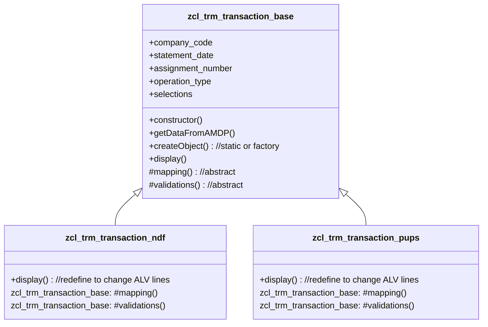

```mermaid
classDiagram
    zcl_trm_transaction_base <|-- zcl_trm_transaction_ndf
    zcl_trm_transaction_base<|-- zcl_trm_transaction_pups
    zcl_trm_transaction_base : +company_code
    zcl_trm_transaction_base : +statement_date
    zcl_trm_transaction_base : +assignment_number
    zcl_trm_transaction_base : +operation_type
    zcl_trm_transaction_base : +selections
    zcl_trm_transaction_base: +constructor()
    zcl_trm_transaction_base: +getDataFromAMDP()
    zcl_trm_transaction_base: +createObject() //static or factory
    zcl_trm_transaction_base: +display()
    zcl_trm_transaction_base: #mapping() //abstract
    zcl_trm_transaction_base: #validations() //abstract
    class zcl_trm_transaction_ndf{
      +display()  //redefine to change ALV lines
      zcl_trm_transaction_base: #mapping() 
      zcl_trm_transaction_base: #validations() 
    }
    class zcl_trm_transaction_pups{
      +display()  //redefine to change ALV lines
      zcl_trm_transaction_base: #mapping() 
      zcl_trm_transaction_base: #validations() 
    }
```